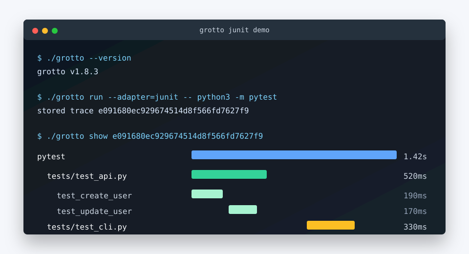

# Grotto

**See exactly where time goes in a slow build, test suite, or shell script — without sending a byte to the cloud.**

Grotto is a local-first Go CLI and Bubble Tea TUI that captures OpenTelemetry traces from shell commands and OTLP-instrumented applications and renders them as proportional-bar waterfalls. Every trace is stored in a local SQLite database (`~/.grotto/grotto.db`). Nothing leaves the machine.

---

## Why it exists

This project is a deliberate skill-fill: Go and observability are the two gaps in a Platform Engineer (DX & AI Infrastructure) profile that had been iOS/Rust/TypeScript-heavy. Building Grotto meant working through genuine OpenTelemetry data model concepts — trace IDs, span IDs, parent chains, span kind, status, typed attributes — rather than a simplified homegrown timestamp format. The OTLP protobuf-to-internal-model mapping, the single-writer SQLite concurrency constraint, and the Bubble Tea TUI architecture are all load-bearing learning exercises, not shortcuts around them.

---

## Architecture

```
  CAPTURE SOURCES                  SHARED SPINE                 PRESENTATION
  ───────────────                  ────────────                 ────────────
  ./script.sh + grotto mark ─UDS─┐
                                 ▼
                         [ span ingest API ]
  instrumented app ─gRPC :4317──►├─map proto─► [ OTel span model ] ─► [ SQLite store ]
  OTLP exporter    ─HTTP :4318──►┘             (trace/span/attr)            │
                                                                  ┌─────────┴────────┐
                                                            [ layout.go ]      [ Bubble Tea TUI ]
                                                          (proportional bars)  (list/waterfall/inspector)
                                                                  │
                                                          [ grotto show ] (static waterfall)
```

The load-bearing design decision: **both capture paths converge on one span model, one store, and one rendering layer.** `grotto mark` emits spans over a Unix domain socket (`GROTTO_SOCK`) with a JSONL spool file as a fallback when the socket is unreachable. `grotto serve` runs a loopback OTLP receiver that accepts gRPC (`:4317`) and HTTP (`:4318`) and maps protobuf `ResourceSpans` into the same `model.Span` structs. `internal/render/layout.go` — a pure function from a span tree and terminal width to per-span bar offset/width — is shared by both `grotto show` (static printer) and the interactive TUI.

### Key decisions

| Decision | Choice | Why |
|---|---|---|
| SQLite driver | `modernc.org/sqlite` (pure Go) | No cgo; single static binary; local volumes don't need the cgo speed edge |
| OTLP transport | gRPC `:4317` + HTTP `:4318`, gRPC primary | gRPC is the canonical OTLP transport and the deeper learning; HTTP is the fallback demo path |
| Span capture | Hybrid: `grotto mark` AND OTLP receiver | Both feed one OTel span model → one SQLite store → one TUI |
| Internal data model | Genuine OTel spans (trace/span/parent/kind/status/attrs) | The OTel data-model learning is half the point — no homegrown timestamps |
| Marks transport | UDS at `GROTTO_SOCK`, JSONL spool fallback | Survives subprocess boundaries without an always-on daemon |

---

## Build

Grotto requires Go 1.22+ and has no cgo dependency. The SQLite driver is `modernc.org/sqlite` (pure Go), so the binary is fully static.

```bash
# Single binary for your current platform
CGO_ENABLED=0 go build -o grotto ./cmd/grotto

# Lint (golangci-lint 1.60+)
golangci-lint run ./...

# Tests
go test ./...
```

Cross-compiled static binaries (`dist/grotto-darwin-arm64`, `dist/grotto-linux-amd64`, each ~17 MB when stripped for release) are produced via `make build` / `make build-all`. The `CGO_ENABLED=0` gate is enforced from the first commit — any transitive cgo dependency is a hard build failure, not a warning.

### Install the latest release

The latest public release is [`v1.8.3`](https://github.com/saagpatel/Grotto/releases/tag/v1.8.3), with static binaries and checksums for macOS arm64 and Linux amd64.

```bash
# macOS arm64
curl -L -o grotto https://github.com/saagpatel/Grotto/releases/download/v1.8.3/grotto-darwin-arm64
chmod +x grotto
./grotto --version

# Linux amd64
curl -L -o grotto https://github.com/saagpatel/Grotto/releases/download/v1.8.3/grotto-linux-amd64
chmod +x grotto
./grotto --version
```

---

## Usage

### Capture marks from a shell script

Wrap any command with `grotto run`. Any `grotto mark` calls inside the command (or its subprocesses) are collected over the Unix domain socket and assembled into one trace.

```bash
# Run a script and capture its marks as OTel spans
grotto run -- ./build.sh

# From inside the script, emit a span boundary
grotto mark "compile"
grotto mark "link"
grotto mark "test"
```

`grotto run` sets `GROTTO_SOCK` and `GROTTO_SPOOL` in the child's environment. Each `grotto mark <name>` call opens the socket, writes a JSON record, and waits for a one-byte acknowledgement — so the mark is durably held before the `grotto mark` process exits. If the socket is unreachable (e.g. nested subshell), the mark spools to `GROTTO_SPOOL` instead. N marks produce N child spans under one root span covering the full command duration.

### Subdivide a section with `--child`

A `grotto mark <name> --child` nests one level under the most recent non-child mark, subdividing that section — useful for breaking a coarse phase into its sub-steps. Any time inside a parent not covered by a marked child renders as a `(gap)` row, so unaccounted work (a `go vet` before the compile, setup before the first mark) stays visible instead of vanishing into the parent's bar.

```bash
grotto run -- tests/fixtures/nested-build-script.sh
grotto show <trace-id>
```

```
nested-build-script.sh  ████████████████████████████████████████  370ms
  (gap)                 ██  18ms
  build                   █████████████████████████████  267ms
    (gap)                 █████████  79ms
    compile                        █████████████  118ms
    link                                       ███████  68ms
  test                                                 █████████  85ms
```

Here `compile` and `link` are `--child` marks subdividing `build`; the `(gap)` under `build` is the unmarked step before the first child, and the leading `(gap)` is startup before the first mark. A child span ends at the very next mark of any kind. See [`tests/fixtures/nested-build-script.sh`](tests/fixtures/nested-build-script.sh).

### Auto-instrument a `cargo build` with `--adapter`

`grotto mark` can't reach inside `cargo build` — cargo owns the compile loop, so the build is one opaque bar. The `cargo` adapter fixes that: it injects `cargo`'s stable `--timings` flag, parses the per-unit report cargo emits, and turns each compiled crate into a child span. No source changes, no instrumentation.

```bash
# Per-crate waterfall for any cargo build or test
grotto run --adapter=cargo -- cargo build
grotto show <trace-id>
```

```
cargo                                   ████████████████████████████████████████  5.80s
  (gap)                                 ███  460ms
  serde_core v1.0.228 (build-script)      ██  190ms
  serde_core v1.0.228                       █████████████  960ms
  syn v2.0.117                              █████████  1.29s
  regex-automata v0.4.14                     ██████████  1.46s
  tokio v1.52.3                                 ████████████████████  2.95s
  (+16 more)                                ████████████████████████████████  5.32s
```

Crates compile in parallel, so their bars overlap — the waterfall shows that natively. The leading `(gap)` is cargo's own dependency resolution before the first crate. A crate that builds a build script and is also used host-side appears as distinct rows — the bare name is the library compile, `(build-script)` is compiling its `build.rs`, `(build-script (run))` is running it.

A large build can produce hundreds of crates, so the long tail collapses into a single `(+N more)` bucket (its bar spans where those crates ran; its number is their summed compile time). The full span set is always stored — only the static waterfall collapses. Tune or disable the cap:

```bash
grotto show <trace-id> --limit 50   # show up to 50 rows per parent
grotto show <trace-id> --limit 0    # show every crate, no bucket
grotto show <trace-id> --json       # full per-crate data, uncollapsed
```

The interactive TUI (`grotto tui`) never collapses — you can scroll and inspect every crate. Adapters are pluggable; `cargo` is the Rust/build adapter.

#### See what the cache saved: diff a cold build against a warm one

Because every crate is a stored span, `grotto diff` gives you a per-crate cache delta for free. Capture a cold build and a warm rebuild, then diff them with `--sort=delta` to rank crates by how much the cache saved:

```bash
grotto run --adapter=cargo -- cargo build   # cold
grotto run --adapter=cargo -- cargo build   # warm (cached)
grotto diff <cold-id> <warm-id> --sort=delta
```

```
total 3.66s → 39ms  (-3.62s)
  cargo                       3.66s → 39ms  -3.62s
    serde_core v1.0.228        970ms → 0ns  -970ms
    serde_derive v1.0.228      960ms → 0ns  -960ms
    syn v2.0.117               740ms → 0ns  -740ms
    serde_json v1.0.150        490ms → 0ns  -490ms
```

`--sort=delta` puts the biggest movers first (default is structural tree order). A crate that got *slower* between runs shows a `+` delta — handy for catching a dependency bump that regressed compile time.

#### Find the build's floor: the critical path

A waterfall shows *where* time went; the critical path shows the *one chain you'd have to shorten to make the build faster*. The cargo adapter records each crate's dependency edges (which units it unblocks), so `grotto show --critical-path` walks the longest-duration chain through that DAG — the sequence that sets the build's minimum time even with unlimited parallelism:

```bash
grotto show <trace-id> --critical-path
```

```
critical path  1.82s  (the build's floor)
6.78s total compile work · 2.97s wall-clock · 24 units, 4 on the path
  syn v2.0.117          ██████████████  670ms
  serde_derive v1.0.228 ██████████████████  850ms
  serde v1.0.228        ████  220ms
  critme v0.1.0         █  80ms
```

Read it as a story: 6.78s of compile *work* ran in 2.97s of wall-clock thanks to parallelism, but it can't drop below **1.82s** because `serde_derive` (a proc-macro) can't compile until `syn` finishes, and `serde` can't expand its derives until `serde_derive` finishes. Throwing more cores at this build won't help — shortening that chain (or the proc-macro) will. (Only `--adapter=cargo` traces carry dependency edges; the flag degrades with a clear message on other traces.)

#### Frontend vs codegen: why a crate is slow

cargo splits each crate's compile into a *frontend* phase (parse, type-check, borrow-check, macro expansion) and a *codegen* phase (LLVM codegen + optimization). Grotto stores both as sub-spans; `grotto show --sections` nests them under each crate:

```bash
grotto show <trace-id> --sections
```

```
  serde_core v1.0.228   █████████████  940ms
    frontend            ████████████  880ms
    codegen             █  60ms
  syn v2.0.117          █████████  690ms
    frontend            ████████  600ms
    codegen             █  90ms
```

`serde_core` spends 94% of its time in the frontend — it's trait/generics-bound, so codegen optimization flags won't help it; a codegen-heavy crate is the opposite. The sub-phases are stored on every cargo trace (visible in `--json` and the interactive TUI) but hidden from the default waterfall to keep it uncluttered.

### Auto-instrument `go test` with `--adapter`

The adapter mechanism is pluggable — `cargo` is one, `go-test` is another. `grotto run --adapter=go-test` injects `-json`, parses the event stream, trims this module's import prefix from package labels, and turns a slow test run into a package → test waterfall:

```bash
grotto run --adapter=go-test -- go test ./...
grotto show <trace-id> --limit 10
```

```
go                                ████████████████████████████████████████  231ms
  (gap)                           █████████████████████  120ms
  internal/render                                       █  611µs
    (+55 more)                                          █  404µs
    TestInsertGaps                                      █  72µs
  internal/adapter                                       █  7ms
    ...
```

Per-test spans carry pass/fail status (failed tests get the `!` marker), and the leading `(gap)` is `go test`'s own compile-before-run time. Two runs diff cleanly — `grotto diff <a> <b> --sort=delta` surfaces which tests got slower. (Adding an adapter is one file plus one registry line; `critical-path` and `--sections` are cargo-specific and degrade gracefully on go-test traces.)

### Auto-instrument JUnit XML test reports with `--adapter`

`grotto run --adapter=junit` turns a JUnit XML report into a per-suite/per-test waterfall. v1.8 targets pytest out of the box: Grotto injects `--junitxml` pointed at a per-run scratch directory, lets pytest write the report, then reads that report back into spans.



```bash
grotto run --adapter=junit -- python3 -m pytest
grotto show <trace-id>
```

If you already have a JUnit XML artifact from CI, import it without rerunning the suite:

```bash
grotto run --adapter=junit --junit-file=reports/junit.xml -- true
grotto show <trace-id>
```

The wrapped command still supplies the root trace label and exit status; `true` is enough when the report already exists. In explicit-file mode, Grotto reads the artifact as-is and expands the root span to fit the report durations, so a tiny wrapper command does not squash the waterfall.

A clean release smoke test looks like this:

```bash
$ ./grotto --version
grotto v1.8.3

$ ./grotto run --adapter=junit -- python3 -m pytest
stored trace e091680ec929674514d8f566fd7627f9

$ ./grotto show e091680ec929674514d8f566fd7627f9
pytest        ████████████████████████████████████████  1.42s
  test_api    ███████████████  520ms
  test_cli                         █████████  330ms
```

```
pytest                             ████████████████████████████████████████  1.42s
  tests/test_api.py                ███████████████  520ms
    test_create_user               ██████  190ms
    test_update_user                     █████  170ms
    test_delete_user                          ████  160ms
  tests/test_cli.py                                      █████████  330ms
    test_help_output                                     ██  70ms
    test_run_command                                         █████  190ms
```

JUnit XML carries durations but not start times, so Grotto lays tests out sequentially within each suite. That is exact for serial pytest and approximate for parallel runners; the durations remain real. If you pass your own `--junitxml` in normal capture mode, Grotto overrides it with a warning so the adapter can reliably read the report it owns; use `--junit-file=PATH` when you want to preserve and import an existing artifact.

### Receive OTLP spans from an instrumented app

```bash
# Start the loopback receiver (gRPC :4317 + HTTP :4318)
grotto serve

# In another terminal, point any OTel exporter at localhost:4317
# or use otel-cli to emit a test span
otel-cli span --endpoint localhost:4317 --name "my-span"
```

The receiver binds `127.0.0.1` only. It warns on stderr if a non-loopback address is configured.

### Inspect traces

```bash
# List recent traces (newest first, last 50)
grotto list

# Static waterfall for a trace
grotto show <trace-id>

# Raw JSON (spans + attributes)
grotto show <trace-id> --json

# Per-span duration delta between two runs
grotto diff <trace-id-a> <trace-id-b>

# Preview the exact redaction plan without changing the trace or database
grotto redact-preview <trace-id>
grotto redact-preview --file tests/fixtures/redaction/synthetic-trace.json --json

# Interactive TUI: run list → waterfall → span inspector
grotto tui
```

`--json` keeps raw nanosecond fields for scripts, but renders OTel enums as labels
instead of integers: span `kind` values are `internal`, `server`, `client`,
`producer`, `consumer`, or `unspecified`; `status` values are `unset`, `ok`, or
`error`.

### TUI navigation

`grotto tui` opens a three-screen Bubble Tea app. **Screen 1** (Run List) shows recent traces with label, span count, duration, and source (`mark` or `otlp`). Press `enter` to open the **Waterfall** view (Screen 2), which renders proportional bars with keyboard scroll and expand/collapse. Press `enter` on any span to open the **Inspector** (Screen 3), which shows the span's typed attributes, kind, status, and timing. `esc` returns up a level; `q` quits.

---

## What I learned: the OpenTelemetry data model + Go idioms

### Genuine OTel shapes instead of homegrown timestamps

The temptation on a project like this is to model "spans" as a simple pair of timestamps with a name. Grotto deliberately resists that — every span carries the full OTel shape: a 128-bit trace ID and 64-bit span ID in hex, a nullable `parent_span_id` (empty string for roots), a `SpanKind` (Internal/Server/Client/Producer/Consumer), a `StatusCode` (Unset/Ok/Error), nanosecond start/end times, and typed attributes (`str`, `int`, `float`, `bool`). This matters because the OTLP receiver maps real protobuf `ResourceSpans` into these types — if the internal model were simpler, something would have to be thrown away, and the mapping would be lying about what OTel actually carries.

### Assembling a tree from a flat span list

The SQLite store persists spans in a flat table with a `parent_span_id` foreign key. `AssembleTree` in `internal/model/span.go` reconstructs the parent/child hierarchy from that flat list: it builds a map from span ID to `*TreeNode`, iterates to wire children under parents, and then sorts each node's children by start time for deterministic rendering. The function is defensive against malformed input from both capture paths — duplicate span IDs (first wins), multiple root spans (first in input order wins), and orphaned or self-parented spans (dropped, never attached, so no cycle is reachable from the root). That defensive stance came from a real constraint: the OTLP receiver accepts spans from any exporter, not just ones Grotto emitted.

### The OTLP protobuf → internal model mapping

`internal/otlp/mapproto.go` maps `otlp.proto`'s `ResourceSpans` → `ScopeSpans` → `Span` chain into `model.Span`. The interesting parts: span and trace IDs in the proto are raw `[]byte` and need to be hex-encoded to match what the marks path generates; attribute values are a protobuf oneof (`AnyValue`) that has to be type-switched to recover `str`/`int`/`float`/`bool` and store the type tag alongside the string representation; and `SpanKind` and `StatusCode` are proto enums that map 1:1 to the internal constants. Getting the attribute round-trip right — so `grotto show --json` emits the same typed value the exporter sent — required unit-testing the mapping against a fixture rather than trusting the obvious-looking code.

### Pure-Go SQLite as a hard constraint

`modernc.org/sqlite` is a pure-Go reimplementation of SQLite via generated C-to-Go translation. The reason it matters here is not performance — a local trace store with hundreds of spans doesn't need `mattn/go-sqlite3`'s speed. It matters because `CGO_ENABLED=0 go build` is a hard gate from Phase 0. A cgo dependency anywhere in the dependency graph breaks the single-static-binary constraint that makes Grotto distributable as a `curl | tar` install. `go mod why` catches offenders; replacing them is mandatory, not optional.

### Single-writer SQLite to avoid lock contention

The OTLP receiver runs two concurrent goroutines (gRPC server + HTTP handler). Both need to write spans to the same SQLite file. SQLite supports only one writer at a time, so naively opening the db from both would produce `database is locked` errors under load. The solution in `internal/store/sqlite.go` is `db.SetMaxOpenConns(1)` — the connection pool is capped to one, so the `database/sql` pool serializes all writes. The OTLP `Sink` in `internal/otlp/sink.go` adds a buffered channel in front of the store: receivers write to the channel, a single goroutine drains it to the store. This gives the gRPC and HTTP handlers non-blocking ingest while keeping the store single-writer.

### Go error wrapping, context, and goroutine ownership

Coming from Rust (explicit `Result`) and Python (exceptions), Go's error model needed deliberate attention. The rule enforced throughout: every error that crosses a function boundary is wrapped with `%w` so callers can use `errors.Is`/`errors.As`. Errors are never silently swallowed — either returned or logged. Every blocking or IO function takes `context.Context` as its first parameter, and cancellation propagates through the exec'd child command (`exec.CommandContext`), the gRPC server, and the HTTP server shutdown. Every `go` statement has a named owner and a clear exit path — no fire-and-forget goroutines. The collector's concurrent mark handlers, the sink's drain goroutine, and the two OTLP server goroutines each have explicit `WaitGroup` or channel coordination to ensure clean shutdown.

---

## Security / privacy

Grotto is local-only by design. The OTLP receiver binds `127.0.0.1` and is unauthenticated — this is deliberate for a developer tool, and Grotto warns on stderr if a non-loopback address is used. No trace data leaves the machine; the database lives at `~/.grotto/grotto.db` (overridable via `GROTTO_DB`).

Before any trace is written to disk, `internal/store/redact.go` applies a redaction pass against four credential patterns: AWS access key IDs (`AKIA…`), GitHub personal access tokens (`ghp_…`), OpenAI-style secret keys (`sk-…`), and Slack tokens (`xox[baprs]-…`). Matches in span names, run labels, and attribute values are replaced with `‹redacted›`. The redaction runs at the single `InsertTrace` chokepoint so both capture paths are covered without duplicating the logic.

The P08 policy evaluator extends that chokepoint with a versioned, field-by-field policy for authorization headers, tokens, cookies, email/home-path/URL data, GenAI content, nested JSON, binary values, and size/depth bounds. `grotto redact-preview` uses the same evaluator against imported JSON or a locking read-only SQLite connection with normal change detection. Report paths pseudonymize instrumentation-supplied attribute and JSON keys, its output is raw-content-off, and there is no reveal mode. See [privacy](docs/privacy.md), [policy](docs/redaction-policy.md), and the [five-minute demo](docs/demo-redaction-preview.md).

---

## Stack

- **Go** 1.22+
- **CLI** — [Cobra](https://github.com/spf13/cobra) 1.8+
- **TUI** — [Bubble Tea](https://github.com/charmbracelet/bubbletea) 0.27+ / lipgloss / bubbles
- **Tracing** — OpenTelemetry Go SDK 1.30+ · OTLP proto 1.3+ · gRPC 1.66+
- **Storage** — [modernc.org/sqlite](https://pkg.go.dev/modernc.org/sqlite) 1.33+ (pure Go, no cgo)
